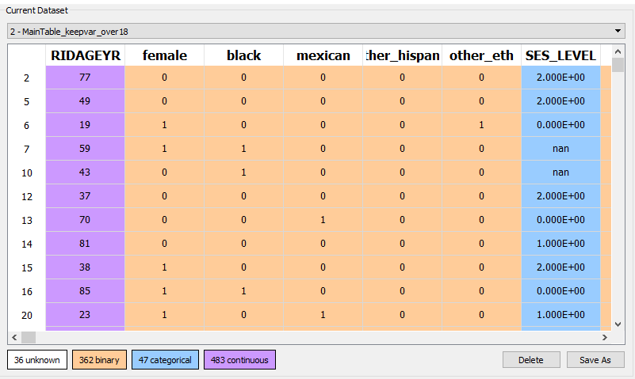
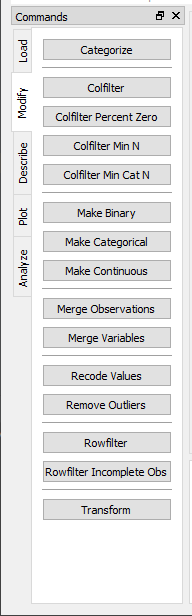
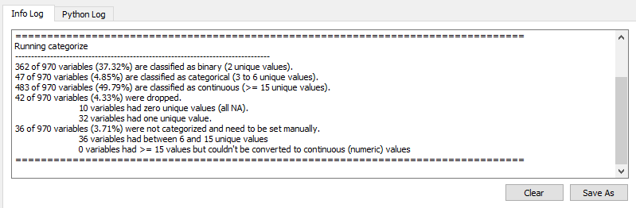
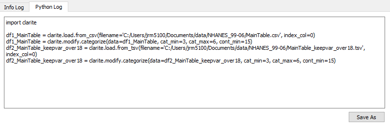
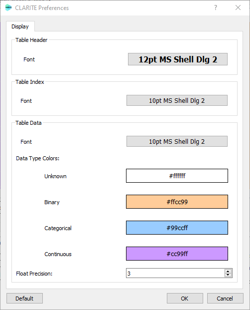

===============
Getting Started
===============

Organization of Functions
-------------------------

CLARITE has many functions organized into several different modules:

Analyze
  Functions related to calculating EWAS results

Describe
  Functions used to gather information about data

Load
  Functions used to load data from different formats or sources

Modify
  Functions used to filter and/or modify data

Plot 
  Functions that generate plots

Survey (not separated in the GUI)
  Functions and classes related to handling data with a complex survey design

Main parts of the UI
--------------------

Data View
*********

The data view includes a drop-down selector to move between different datasets.  The currently selected dataset is shown.
Variables are color-coded by their type (unknown, binary, categorical, or continuous) and are all continuous by default
until the `categorize` function is used or they are converted via the right-click menu.

Command Bar
***********

Each module (other than Survey) has a command tab, with buttons corresponding to each function in that module.
The button for each function will open a unique dialog with all of the available parameters for that function.
Further documentation on each function can be found in the `CLARITE-Python Documentation`_.

.. _`CLARITE-Python Documentation`: https://clarite-python.readthedocs.io/en/stable/

Functions will (if applicable) use the currently selected dataset as input.  Some functions may not be enabled if the
currently selected dataset is not a compatible input, or if multiple datasets are required.  For example, the manhattan
plot function can only be used if the currently selected dataset is EWAS results.

The command bar can be shown/hidden and docked/undocked via the "View" menu.

Logs
****

`Info Log`

The info log records the functions that are used, and any relevant logging information.  It may be saved to a text file
and/or cleared.

`Python Log`

The equivalent python command for each function is recorded in the Python Log.  This file can be saved as a python script
which should repeat the analysis as it was performed in the GUI, as long as the location if input files doesn't change.

Preferences
***********

Various display settings can be adjusted in the Preferences dialog (found in the `Edit` section of the menu).

